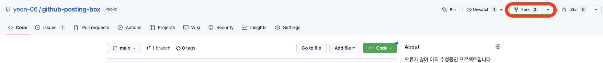
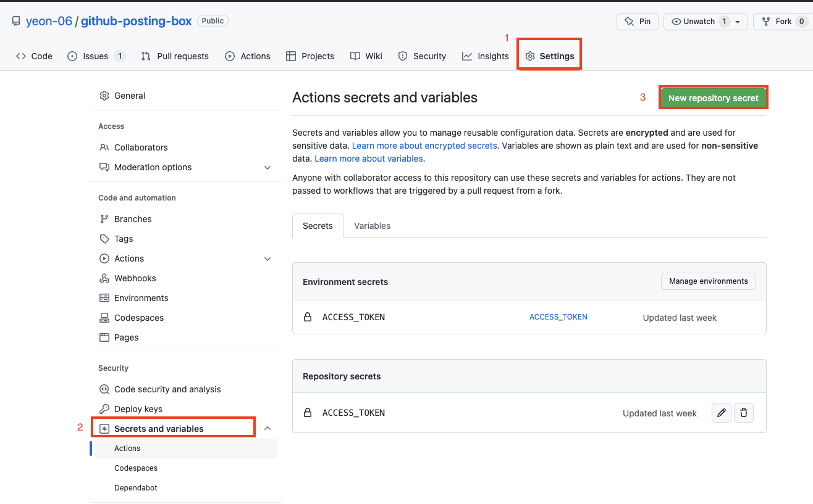
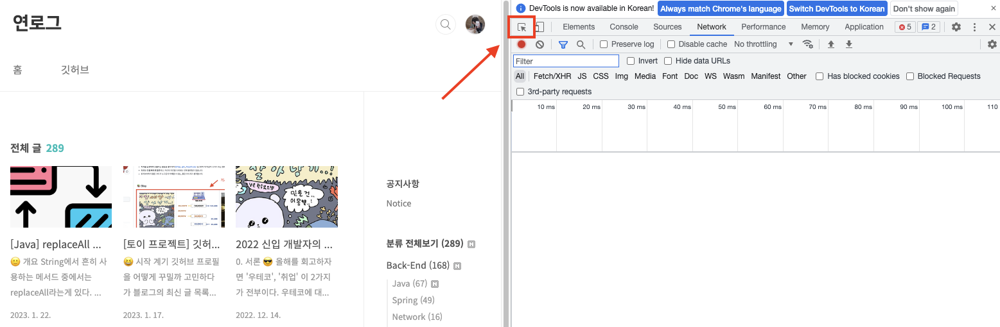
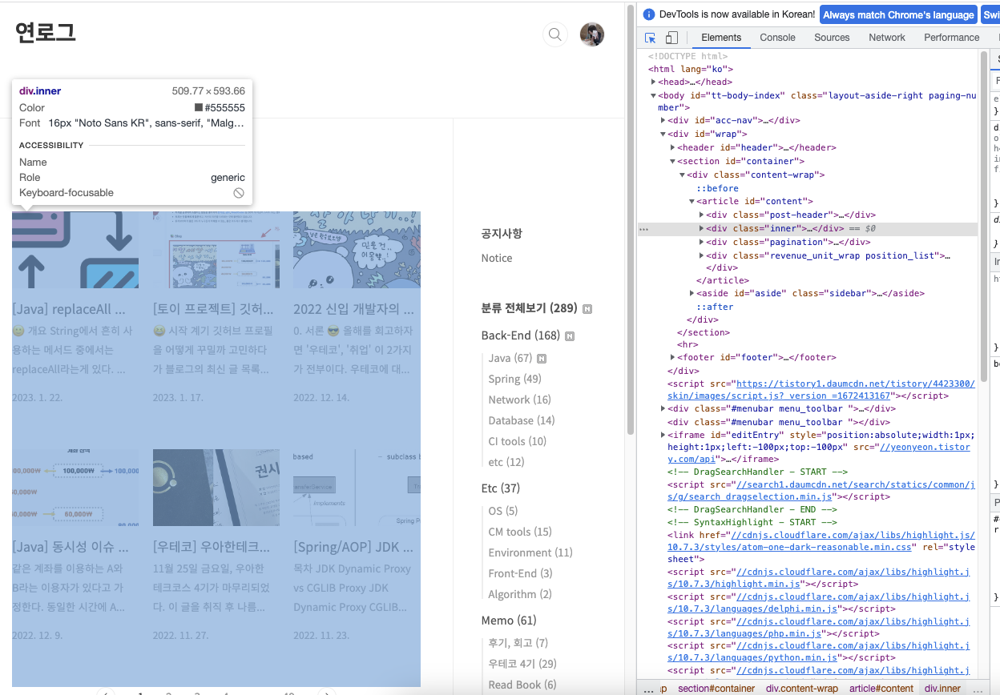
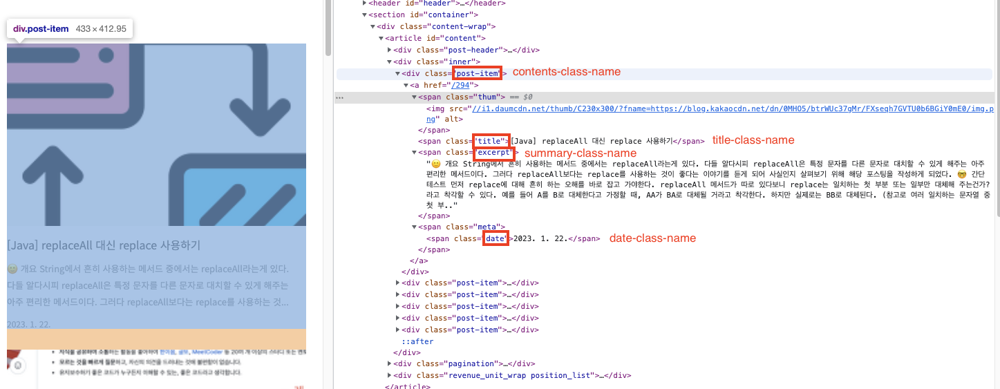
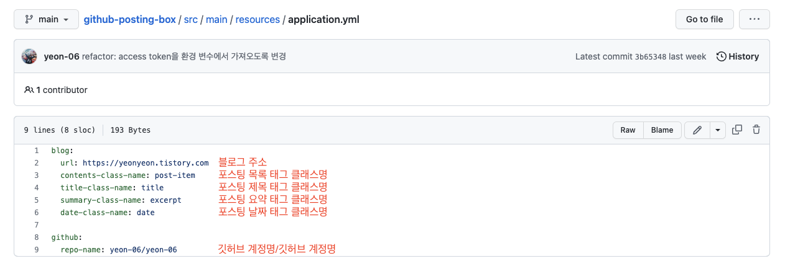
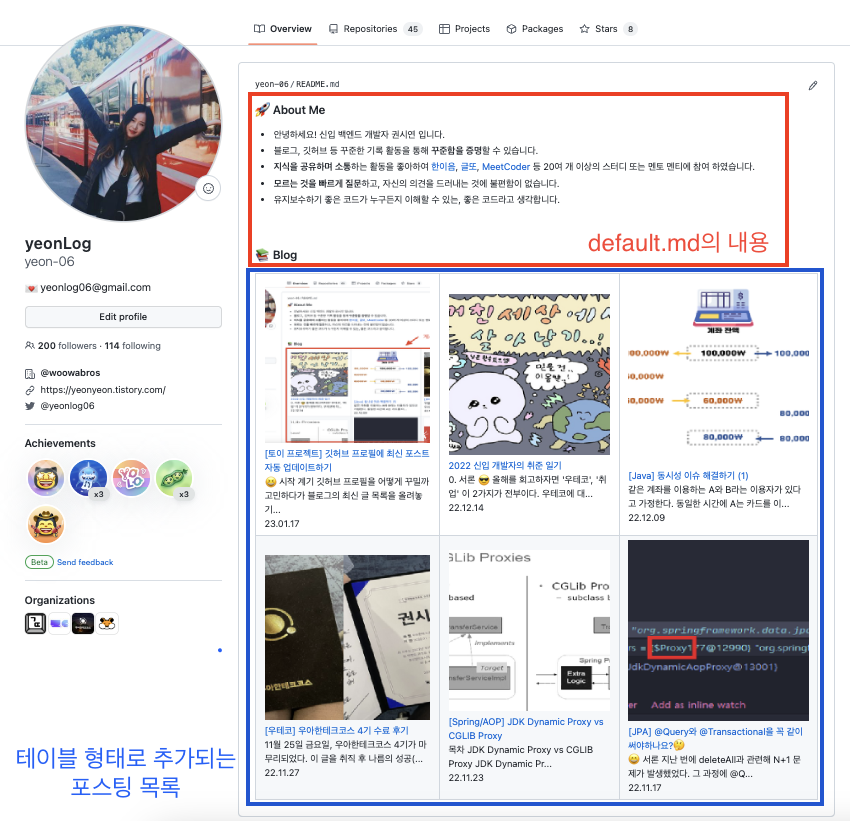

# 깃허브 포스팅 박스

> 리드미 마지막 수정일 2023.01.22

- 티스토리 최신 글들을 리드미에 업데이트 한다.
- [⛓️ 개발 일지 링크](https://yeonyeon.tistory.com/293)

 

### 주의사항

- 아직 불완전한 레포지토리로 오류가 많이 발생할 수 있으며 제약사항이 많습니다.
- 블로그 글은 6개 이상 존재한다고 가정합니다.
- 최신 글 업데이트는 매일 0시에 진행됩니다.

 

### 사용 방법

#### 1. repository fork

- [GitHub Repository](https://github.com/yeon-06/github-posting-box)에서 fork 버튼을 누른다.

 

#### 2. GitHub Access Token 발급 후 Secrets 등록

- [GitHub Docs](https://docs.github.com/ko/authentication/keeping-your-account-and-data-secure/creating-a-personal-access-token)에 따라 Access Token을 발급받는다.
- fork 받은 레포지토리의 settings - secrets and variables - new repository secret을 누른다.
- `ACCESS_TOKEN`이라는 이름으로 아까 발급받은 access token을 등록한다.
  (Repository secrets에 등록되면 성공!)

 

#### 3. application.yml 수정

- 자신의 정보에 맞게 application.yml 값 수정한다.
- application.yml은 [`./src/main/resources/application.yml`](./src/main/resources/application.yml)에 위치한다.

 

- chrome에서 F12를 누르고 아래와 같은 아이콘을 클릭한다.

- 포스팅 목록에 해당하는 영역을 찾아낸다.

- 각 알맞은 값을 application.yml에 입력한다.

- application.yml 수정  

 

#### 4. 리드미 템플릿 변경

- 포스팅 목록은 리드미 하단에 테이블 형태로 추가된다.
- 리드미 상단에 작성될 글은 [`/src/main/resources/templates/default.md`](./src/main/resources/templates/default.md)에 작성한다.

 
